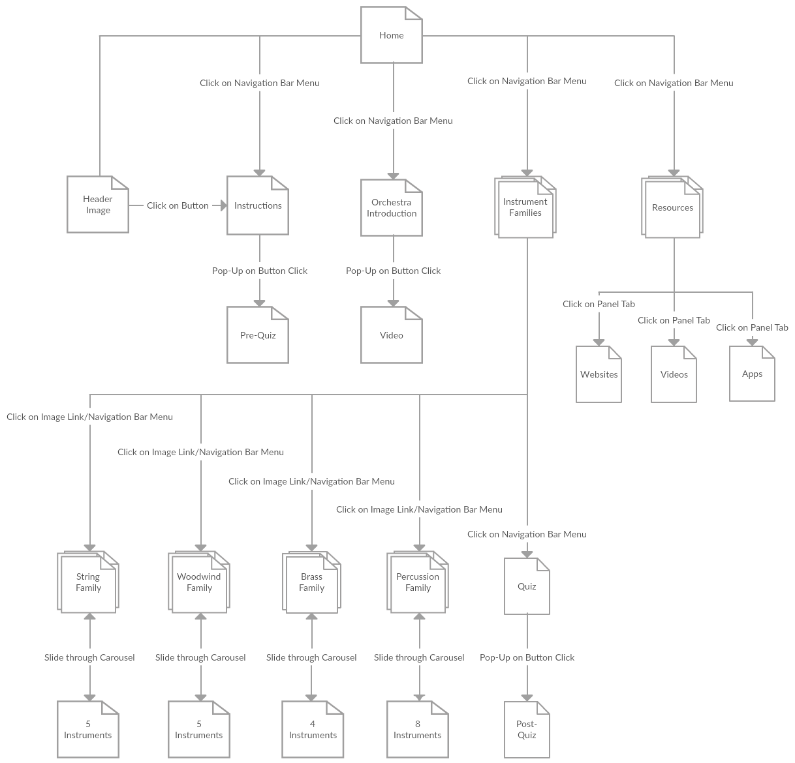
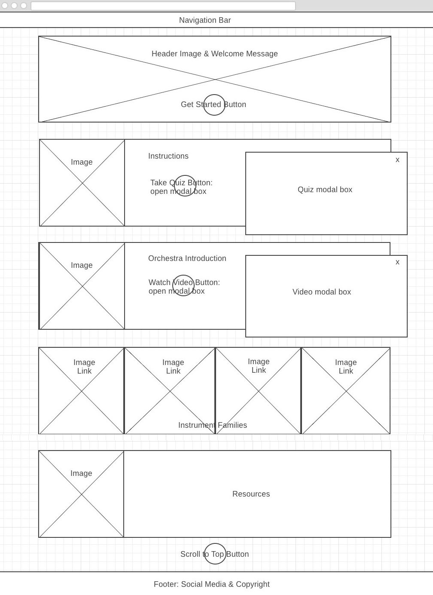
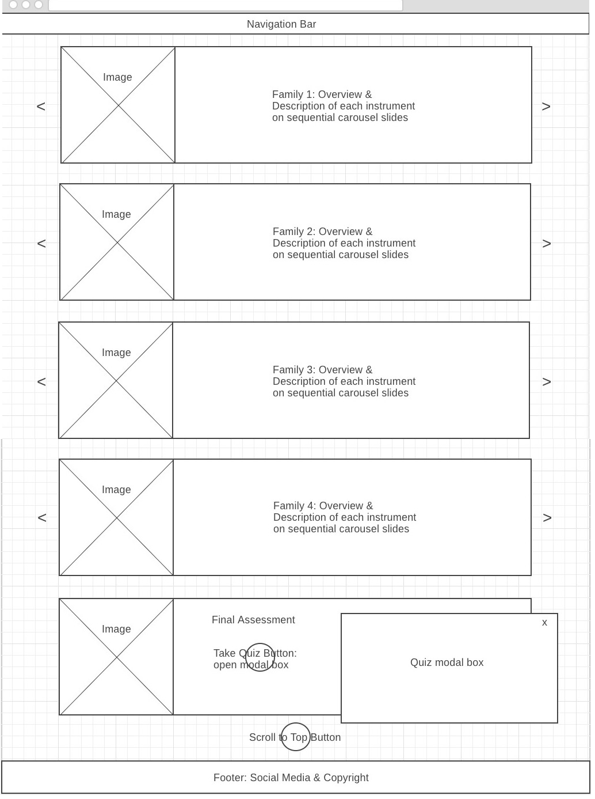

# **Design Document**

My website is called **Symphonia**, a beginner level learning resource for orchestra education, focusing on musical instruments. It can be accessed at this [Github Page link](https://ewongosari.github.io/midterm/). During the design thinking process, I have implemented Jesse Garrett's *Model of 5 Elements of User Experience*, which are outlined in the following sections. This method is basically a backward design process that helps designers like me to focus on the design vision or objective while making important decisions. That way my end product would not deviate too much from its true purpose. I will also explain how I have utilized the learning theories of *motivation, microlearning, cognitive overload, multimedia learning, and multiple learning styles* to influence the design and creation of my website.

## Topic
The domain of my website is music education, and its subject is orchestra education. The main purpose for this website is to **teach novice adult learners, who has no background or prior knowledge of orchestra, the different families of orchestral music instruments and the individual instruments that belong there.** As my website is only a small component of orchestra education, it can be linked to other orchestra-focused websites to teach the whole spectrum of orchestra education topics. It can also serve as an introductory component to other music websites or programs that teach how to play the musical instruments.

## Problem

### Learning Problem
The main problem that I need to tackle with this topic of learning about orchestral musical instruments is the **huge amount of available information** scattered around the Internet. It seems that each prominent symphony orchestra has an educational section on its website. This is also not counting other music-related websites that are not affiliated with the orchestra, ranging from theory-focused to learning about practical instrument playing. Fortunately, a majority of the topic information overlaps but there are still many different variations.

### Solution and Rationale
I determined that having **a central hub of information** is crucial, especially for **scaffolding beginning learners**, so that they would not be overwhelmed at the start and lose their motivation to learn. I also applied the **microlearning strategy**, in which information are presented in small chunks at a time, to help learners to easily digest new information and reduce the chances of **cognitive overload**. Now most of the orchestra education websites I have come across in my research are very text-heavy. At the most, they employ pictures and some audio but they are not organized well with the main content. Thus, I have implemented the **multimedia learning theory** that states that iterations of the same content at the same time in different multimedia formats may help learners to retain information better than just text-based content. At the same time, I am able to cover the different **learning styles** of my learners--visual, auditory, and kinesthetic.

## Target Audience
My target audience are **adult learners from college age to older who want to learn about the different orchestral music instruments but has no prior knowledge about them.** They can be interested in the topic because they are taking classes in classical music or orchestra education, are teaching the topic to other people in formal or informal situations, or are going out and watching an orchestra performs for the first time and want to know more about it. I have described below some **user stories** to put these types of learners in more context:

### User Stories

* **User Story 1:**

  

  This is Jaime. She is a senior majoring in TESOL in a 4-year liberal-arts college. As part of the requirements for her degree, she is taking a music class this semester and one of the topics they are learning is the orchestra. Working together in pairs, Jaime and her partner have to give a 5-minute presentation on their chosen instrument family. Because they are pretty much beginners who know nothing about the subject, they decide to do their research as early as possible. But they are soon overwhelmed by the amount of information in the Internet and many of them have different variations. In addition, Jaime is having a full load of taking classes and student teaching at a public middle school, thus she cannot spend too much time in analyzing sources. She reaches out to her music professor for guidance and she points out my website as a credible resource. Jaime likes the bite-sized content as it is not overwhelming and the resources listed in my website has extensive curated information so she feels that they have good credibility and uses them in her presentation.

* **User Story 2:**

  

  This is Flora. She is a 35 year old single mother working as a bank manager with precocious 9 year old twin daughter and son. Her children has an upcoming project on the orchestra and classical musical instruments, and they will have a school field trip to the orchestra in 1 week. Flora wants to inform her children on "the basics" before their trip so that they would not get too confused and can enjoy their experience more. However, due to her busy schedule at work and at home, she does not have much time to do her research. She finds out about my website from a colleague with an older daughter at the same school, who had taken the same music class. She likes that the website has a minimalistic yet aesthetically-pleasing look and it is easy to find the relevant content. The materials on each instrument are also written in a simple-to-understand language and the supplementary multimedia helps to reinforce the content.

* **User Story 3:**

  

  This is Greg. He is a retired car dealer in his 70s. For his 50-year marriage anniversary's present, one of his children gave him a pair of VIP tickets to the orchestra for his wife and him to enjoy. He had never been to the orchestra at all in his life since he had a hectic schedule in his business and had no interest in music. But he knows very well that his wife is a big fan of classical music and figures that trying out the orchestra for the first time is something that will please her. However, he decides that he really need some background information before they go so as to not embarrass himself on the important day, and perhaps impress his wife a little bit. Fortunately, one of his son-in-law is a high school music teacher and he recommended my website for Greg as it is very simple to navigate. Greg likes that all content are short and to the point, and the instrument and stage position pictures help him to understand better as he is mainly a visual learner.

## Strategy

### Site Objectives
* **Learning Objective:**
  * Beginner adult learners can know and understand the four instrument families within an orchestra and the main musical instruments representing each family after they have gone through the provided content materials.

* **Learning Goals:**
  * Learners are able to know and understand an overview of the orchestra and the stage positions of each instrument family.
  * Learners are able to know and understand the different traits of each instrument families.
  * Learners are able to know and understand each musical instrument through text descriptions, pictures, and audio.

### Success Metrics
* **Pre-assessment:**
  * My pre-assessment is in the form of a short interactive trivia game that test the learner's prior knowledge about the topic. In a fun way, learners can find out on their first visit how much more do they need to learn. Then they can navigate to the relevant content that they have not known about.

* **Final assessment:**
  * My final assessment is in the form of an interactive multimedia quiz that test how well my learners have retained the new information they acquire. This quiz is not just fun and engaging, but it also offers learners the opportunity to re-take it as many times they want after they re-learn the content materials until they are able to reach their desired score.

## Scope
* Here are the **technical or functional specifications** for my website:
  * A *navigation menu bar* that always sits on top of the page
  * *Menu bar links* to different sections on a webpage
  * *Image links* to different instrument families, which are in another page
  * *Slideshow format* of learning content
  * Displaying *pictures and text side-by-side equally* to save space
  * Ability to *take interactive quizzes* in pop-up modals
  * Ability to *play embedded videos* in pop-up modals
  * Ability to *play embedded audio samples* right in each instrument slide
  * *Scroll to top button* for easier navigation
  * *Social media network links* for spreading the word on my website

* Here are the **content specifications** for my website:
  * A *welcoming message* in the header image where learners can get a sense of the purpose of the website
  * *Instructions* on how to best utilize and navigate the website
  * A short *pre-assessment* to gauge learners' prior knowledge
  * A short *introduction* about the orchestra as an overview for the whole topic
  * An engaging *video* that introduces each instrument family
  * *Descriptions* of each instrument family
  * *Descriptions* of each instrument
  * *Pictures* of each instrument
  * Short *audio samples* of each instrument
  * A *final assessment* to figure out how much information the learners understand
  * *Resources* for deeper exploration of topic

## Structure
Here is the **sitemap structure** and **navigation design** of my website:

* Rationale - Reducing navigation links and keeping information in clusters help to keep the learning process in a streamlined manner. All sections can be accessed from the navigation menu and through the links as noted in the diagram below.

## Skeleton
Here are the **wireframes** for my website:

* Index.html
  * The home page of my website consists of the things a learner will encounter before the main lesson, such as instructions, introduction to topic, and a short pre-assessment. There is also a section on further resources that the learner can explore after they are done with the lessons and the option to share my website on social media networks if they like it as a learning resource. I think this is important to spread the word to other learners who are looking to learn my topic and to increase my website traffic. Because of the nature of my long webpages, I have fixed the navigation bar to be always at the top while scrolling, and inserted navigation menu to jump to each information section and scroll buttons for more efficient navigation.

* Instruments.html
  * The main learning content for my website is situated at this page. Because there are four families of instruments, I have grouped the instruments in each family together using sliding carousels. There is also a final assessment to test how well learners understand and recall the information I have presented. Learners can always go back to the home page by clicking on the website logo.

